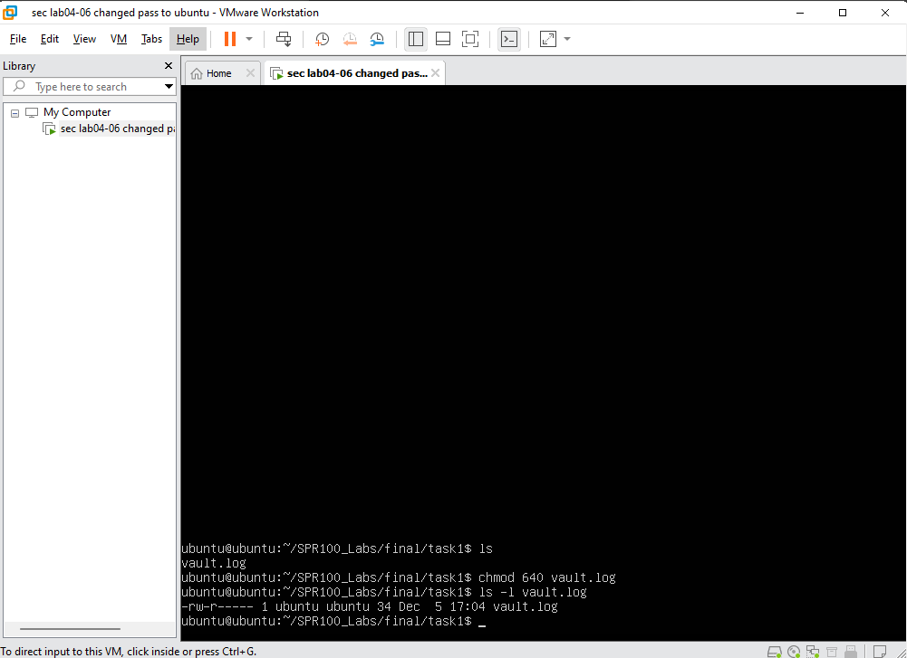
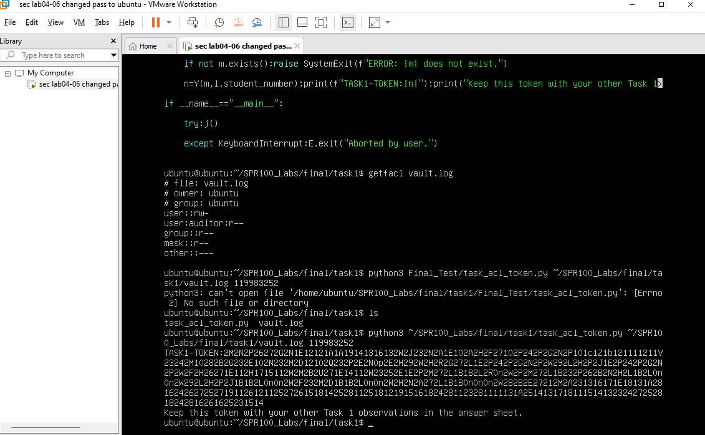

# SPR100 Final Test — Answer Sheet

> ⚠️ Replace every `[placeholder]` with your real answer and delete the brackets.

## Student Information
- **Full Name:** Soroush Bastani
- **Seneca Username:** sbastani1
- **Student Number:** 119983252
- **Security Lab Computer #:** Instructed to ignore

## Submission Checklist
- [ ] `final_exam_answer_sheet.md` saved in `SPR100_Labs/final/`
- [ ] `task1/`, `task2/`, `task3/` folders added with required artifacts
- [ ] Final commit pushed with the REQUIRED finalization command

---

## Task 1 — Vault Custodian

| Item | Your Evidence |
| --- | --- |
| Hostname | `ubuntu` |
| Username used | `ubuntu` |
| `ls -l vault.log` | `-rw-r----- 1 ubuntu ubuntu 34 Dec 5 17:04 vault.log ` |
| `stat --format ... vault.log` | `[ubuntu|ubuntu|640|30]` |
| `getfacl` user line | `user:auditor:r--` |
| `getfacl` mask line | `mask:r--` |
| `sudo -u auditor cat ...` (first line) | `Dec 5 17:03 UTC ubuntu@ubuntu` |
| `TASK1-TOKEN` | `TASK1-TOKEN:2MN2NP26Z72GN1E12E1A1A91413613WZ23N2A1E102AH2F27102P242P2GN2P101C121B11111111V2324M102B82G32E10N232MD2310R232S2A6E2H29P0E2H29E2N2E2N2E21B2B2RONZ28272GN2832E47216AB2B3ZZ...` |

Notes (optional, max 2 sentences):  
`"I used **POSIX ACLs** (setfacl) to create a specific entry for the user. This grants them read access without elevating privileges for the entire group or 'others', adhering to the principle of least privilege."`

Reference Image:



---

## Task 2 — Sentinel Service

- `ls -l watcher.sh`: `-rwx------ 1 ubuntu ubuntu 134 dec 5 17:55 watcher.sh`
- `final-watch.service` contents:
  ```
  [unit file text]
  ```
- Last two `watchdog.log` lines:a
  ```
  [Fill in line -2 here]
  [Fill in line -1 here]
  ```
- `Active:` line from `systemctl --user status final-watch.service`: `[final] systemd user service ran: Fri Nov 14 02:48:08 AM UTC 2025
`
- Latest journal entry (single line): `[Labp5 demo] User login hook executed: Fri Dec 5 18:22:04 AM UTC 2025
[Labp5 demo] User login hook executed: Fri Dec 5 18 18:40:37 AM UTC 2025`
- `@reboot` cron line: `[@reboot bash ...]`
- `TASK2-TOKEN`: `TASK2-TOKEN: 2MN2NP26Z72GN1E12E1A1A91413613WZ23N2A1E102AH2F27102P242P2GN2P101C121B11111111V2324M102B82G32E10N232MD2310R232S2A6E2H29P0E2H29E2N2E2N2E21B2B2RONZ28272GN2832E47216AB2B3ZZ`

Mitigation reminder after grading (do NOT do during test): `[describe how you will remove hooks later]`

---

## Task 3 — Traffic Examiner

```
$ tshark -D
1. lo (Loopback)
2. ens33
3. any (Pseudo-device that captures on all interfaces)
4. docker0 (Docker virtual bridge)


Optional Notes (max 2 sentences to describe what the python program `task_network.py` does):  
`[brief observation]`

---

## Task B — Firewall Sentinel (Bonus)

- Domains/IPs blocked (from Task 3 analysis): `[Fill in here]`
- Commands used to add `ufw` rules:
  ```
  [Fill in here]
  ```
- `sudo ufw status numbered` (trimmed output):
  ```
  [Fill in here]
  ```
- Evidence that Task 3 script is blocked:
  ```
  [Error/output snippet]
  ```
- Evidence that other sites still work:
  ```
  [Successful command/output]
  ```

---

## Final Confirmation
- I confirm I followed all rules and performed the work independently. `[Yes/No]`
- Timestamp of final push (`date -u`): `[YYYY-MM-DDTHH:MM:SSZ]`

**Signature (type your name):** `[Your Name]`

